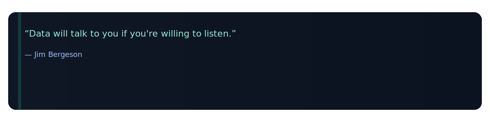

# 👋 Hi, I'm **Phemelo Sebopelo**  
### Aspiring Data Analyst • SQL • Python • Tableau  

I build real-world data projects and document my growth.  
Focused on clarity, clean visuals, and getting better every day.

---

## 🌐 Banner (Coming Soon)
<!-- When your banner is ready, replace this with:

-->

---

# 💻 Tech Stack  

### 🟨 Languages  

### 🎨 Frontend  

### 📊 Data & Visualization  

### 🔧 Tools  

---

# 📌 About Me  

I’m a BSc IT student building a strong foundation in data analysis and practical development.  
I enjoy cleaning data, exploring datasets, writing SQL queries, building dashboards,  
and turning raw information into clear, understandable insights.

- 🔍 Interested in data analytics & automation  
- 📊 Working with SQL, Python, Pandas, Tableau  
- 🌱 Creating a clean HTML portfolio  
- 🔧 Documenting growth through real projects  
- 🚀 Improving my craft one project at a time  

---

# 📁 Highlighted Projects  

### 📌 **Netflix Data Analysis**  
**Python • Pandas • Matplotlib**  
Cleaned & analyzed Netflix titles, visualized insights about genres & content trends.

---

### 📌 **South African Crime Data Analysis**  
**Python • CSV Automation**  
Explored crime rates, categories & visualized nationwide crime trends.

---

### 📌 **Bankruptcy Prediction (ML)**  
**Python • Scikit-learn**  
Built Logistic Regression + Random Forest models on financial bankruptcy dataset.

---

### 📌 **VITACARE Telemedicine (Group Project)**  
**HTML • CSS**  
Contributed to UI structure, page layout & documentation.

---

## 📊 GitHub Activity & Stats

<!-- streak -->

<!-- main stats -->

<!-- top langs (try this first) -->

---

# 🐍 Contribution Snake  

  

---

# 🧠 Random Dev Quote  

  

---

# 🔗 Connect With Me  

📧 **Email:** phemelosebopelo14@gmail.com  
🔗 **LinkedIn:** https://www.linkedin.com/in/phemelo-sebopelo-a428712b2/  

---

### ⭐ _"Improving my craft one project at a time."_  

