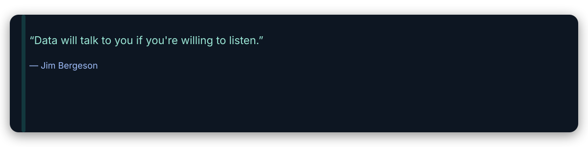

# 👋 Hi, I'm **Phemelo Sebopelo**  
### IT Graduate • Software Development • Systems • Data • Networking Basics

I build practical IT and software projects and document my learning journey.  
Focused on problem-solving, clean implementation, and continuous improvement.

---

# 💻 Tech Stack  

### 🟨 Programming Languages  

### 🎨 Web & Frontend  

### 📊 Data, Databases & Analysis  

### 🔧 Tools & Environment  

---

# 🧠 Core IT Foundations  

- Object-Oriented Programming (Java, C#, C++)  
- Databases & Relational Design  
- Basic Networking Concepts (TCP/IP, LAN/WAN, OSI Model)  
- System Troubleshooting & Technical Support Fundamentals  
- Software Development Lifecycle (SDLC)  
- Version Control & Collaborative Development  

---

# 📌 About Me  

I’m a **BSc IT graduate** seeking entry-level opportunities across **IT support, technician, systems, and junior software development roles**. I have a broad IT foundation built through academic training and hands-on projects, covering software development, databases, networking fundamentals, and system-level problem solving.

Through personal and academic projects, I’ve also developed strong exposure to **data-driven systems**, where I work with SQL, Python, and reporting tools to extract insights and improve how information is processed and presented.

- 💻 Open to IT Support, Technician & Junior Software roles  
- 🛠️ Strong general IT and technical foundation  
- 🗄️ Experience working with databases and system-generated data  
- 📊 Exposure to analytics, reporting & dashboards  
- 🌱 Continuously learning through real-world projects  

---

# 📁 Highlighted Projects  

### 📌 **HNG Ride Performance & Revenue Analysis**  
**SQL (PostgreSQL)**  
Worked with multi-table ride-hailing datasets (7,000+ records) to analyze revenue trends,  
driver performance, ride durations, and user behavior using joins and aggregations.

---

### 📌 **VistaCart Retail Sales Analysis**  
**SQL • Power BI • Excel**  
Performed end-to-end retail data analysis including cleaning, KPI calculations,  
outlet performance evaluation, and dashboard-based reporting.

---

### 📌 **Netflix Data Exploration Project**  
**Python • Pandas • Matplotlib**  
Explored and visualized media datasets to identify content distribution and genre trends.

---

### 📌 **VITACARE Telemedicine System (Group Project)**  
**HTML • CSS**  
Contributed to UI structure, page layouts, and technical documentation.

---

## 📊 GitHub Activity & Stats  

---

# 🐍 Contribution Snake  

  

---

# 🧠 Random Dev Quote  

  

---

## 🤝 Let's Connect  

---

⭐ *"This repository reflects my growth as an IT professional — learning, building, and improving with every project."*

**Developed by — _Phemelo Sebopelo_**

